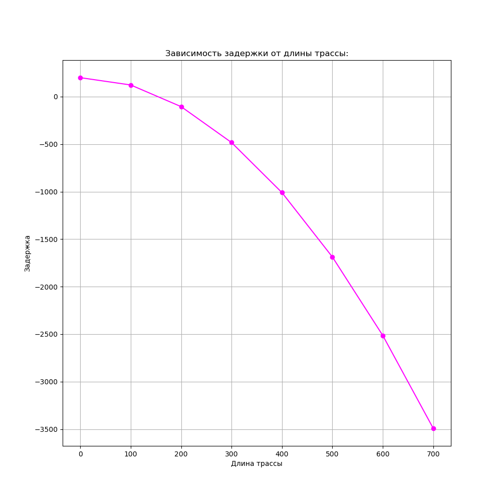
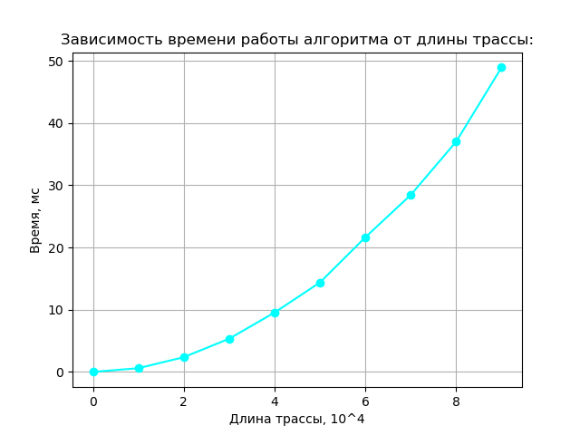

# VLSIProject repo

## Build and Debug
Quick start:
```
$> git clone https://github.com/Ilyagavrilin/VLSIProject.git
$> cmake -B build && cmake --build build
$> ./build/VLSIProject tests/data/tech1.json tests/data/test_new.json
```
## Full build rules
```
$> nix-shell / nix develop (if flakes enabled)
$> cmake -DCMAKE_BUILD_TYPE={Release, Debug} -B build
$> cmake --build build
$> ./build/VLSIProject tests/data/tech1.json tests/data/test_new.json
```
 
## Анализ алгоритма 

Задержка на двухпиновой трассе в зависимости от её длины **L** вычисляется по формуле:

**$$D = D_{sink} - D_{wire}$$**
**$$D_{wire} = \frac{unitR * unitC * L^2}{2} + unitR * L * C_{sink}$$**

Измерения проводились для **$unitR$** = 0.05, **$unitC$** = 0.3, **$C_{sink}$** = 0.5, **$D_{sink}$** = 200.

Результат показал параболическую зависимость, согласующуюся с теорией:



Также было измерено время работы алгоритма в зависимости от длины трассы:



